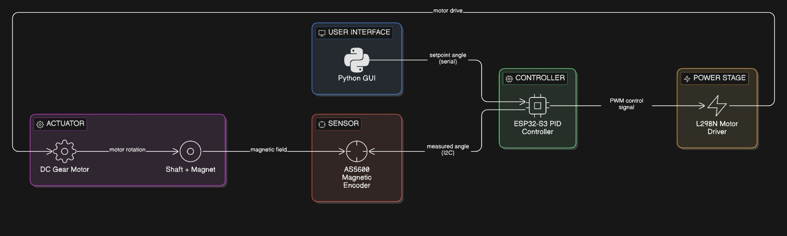

# Closed Loop Position Control of a DC Motor

## Overview
This project implements a closed-loop position controller for a DC gear motor using an ESP32-S3 microcontroller and an AS5600 magnetic encoder. A PID controller is used to track target angles while compensating for friction, backlash, and sensor alignment errors.

## System Architecture

## Hardware Components
- ESP32-S3
- AS5600 Magnetic Encoder
- L298N Motor Driver
- DC Gear Motor
- Neodymium Magnet
- 11.1V LiPo Battery

## Control Algorithm
The controller computes the error between the target angle and measured angle and applies a PID control law:

error = target_angle − measured_angle

control_output = Kp·error + Ki·∫error + Kd·(d/dt error)

## GUI Interface
A Python GUI allows the user to:
- Send target angles
- Monitor real-time telemetry
- Visualize PID behaviour

## Future Improvements
- Adaptive PID tuning
- Higher resolution encoders
- Custom motor driver
